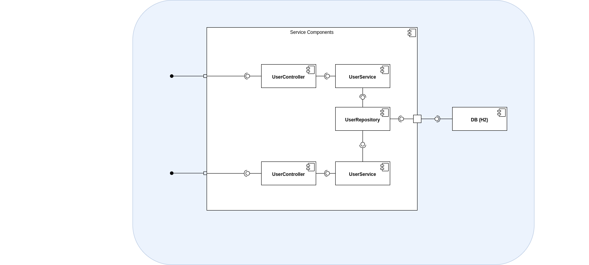
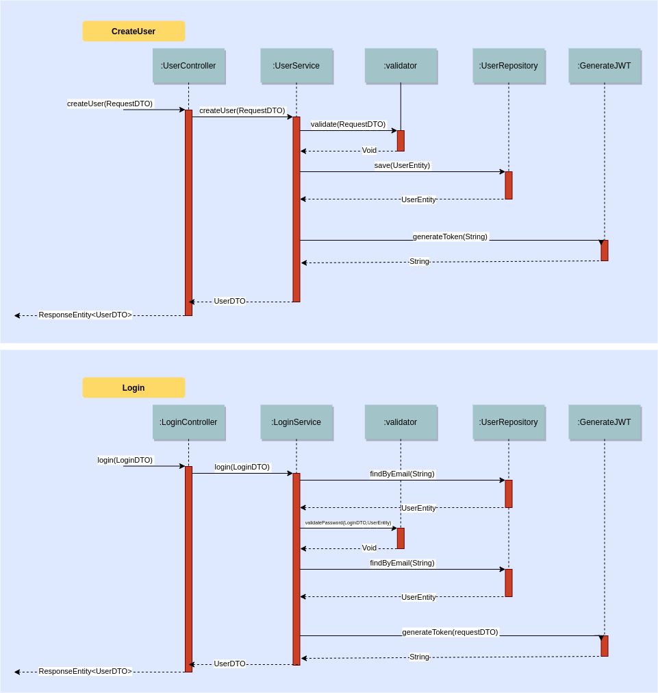

## Ejecución de la aplicación

**Requerimientos**
* Tener instalado la JDK 8
* Tener instalado Gradle 6.6.1

> Nota: Para ejecutar el comando de Gradle tendremos que estar ubicados en la carpeta raíz del proyecto.

### Comando de Ejecucion

    gradle bootRun

### Modo de utilización del API
Para usar las APIs, se dejó dentro del proyecto, un archivo **Postman** llamado **Ejercicio BCI.postman_collection.json** que consta de un ejemplo de invocación de cada método que expone el API de usuario.

El proyecto posee una capa de seguridad, la cual solo deja acceder al método de **login**, no siendo necesario enviarle un token de autentificación.

***
## Diagramas

### Diagrama de componentes

### Diagrama de secuencia

